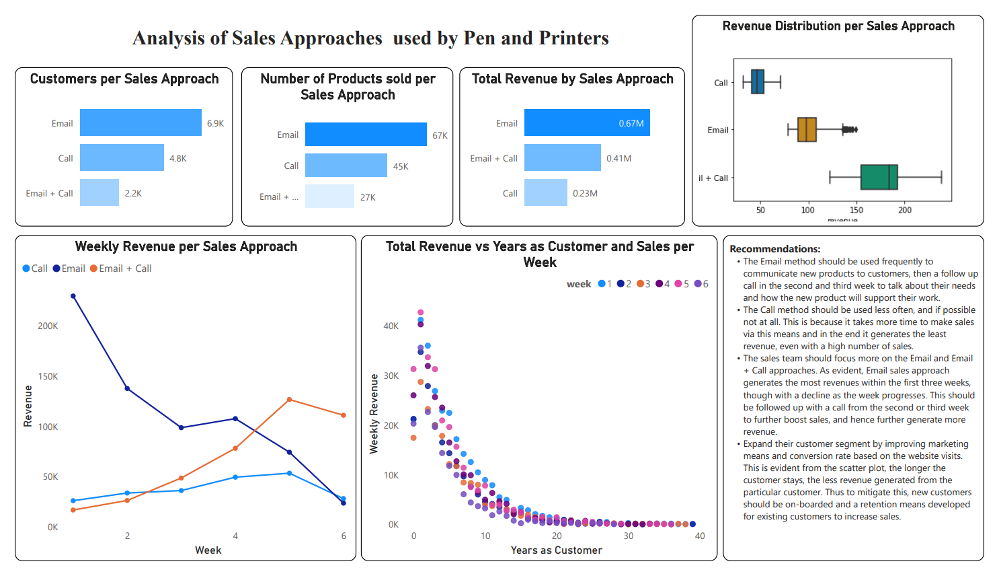

# Product Sales Visualization
A Power BI visualization for the analysis of Pen and Printers, a company that provides high quality office products to large organizations and founded in 1984. They have built long lasting relationships with our customers and they trust us to provide them with the best products for them. As the way in which consumers buy products is changing, our sales tactics have to change too. Launching a new product line is expensive and we need to make sure we are using the best techniques to sell the new product effectively. The best approach may vary for each new product so we need to learn quickly what works and what doesn’t.

The follwoing questions were answered:
1. How many customers were there for each approach?
2. What does the spread of the revenue look like overall? And for each method?
3. Was there any difference in revenue over time for each of the methods?
4. Based on the data, which method would you recommend we continue to use? Some of these methods take more time from the team so they may not be the best for us to use if the results are similar.

## Dashboard

# Recommendations
from the analysis performed using the data provided, the following are recommended:

- Use key metrics to monitor whether there is a change in the sales approach.
- The Email method should be used frequently to communicate new products to customers, then a follow up call in the second and third week to talk about their needs and how the new product will support their work. This recommendation is based on the result obyained from 3 above.
- The Call method should be used less often, and if possible not at all. This is because it takes more time to make sales via this means and in the end it generates the least revenue, even with a high number of sales.
- The sales team should focus more on the Email and Email + Call approaches. As evident in 3 above, Email sales approach generate the most revenues within the first three weeks, though with a decline as the week progresses. This should be followed up with a call from the second or third week to further boost sales, and hence further generate more revenue.
- Expand their customer segment by improving marketing means and conversion rate based on the website visits. This is evident in 4 above, the longer the customer stays, the less revenue generated from the particular customer. Thus to mitigate this, new customers should be on-boarded and a retention means developed for existing customers to increase sales.

> PS: Data validation have been performed in a prior analysis: [Product Sales Analysis](https://github.com/Merci93/Product_Sales_Analysis).
